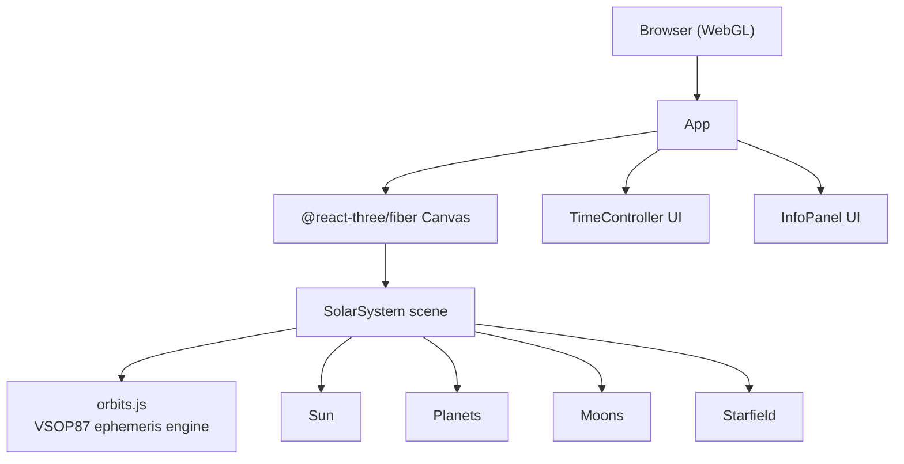

# 🪐 Solar System 3D

An astronomically accurate, interactive 3D solar system simulation — deployed as a
cloud-native web application on Red Hat OpenShift.

---

## Features

| Feature | Details |
|---------|---------|
| **Orbital mechanics** | VSOP87 theory via `astronomia` library — sub-arcsecond accuracy |
| **All 8 planets** | Mercury → Neptune with correct relative sizes and colours |
| **Moons** | Earth's Moon · Io · Europa · Ganymede · Callisto · Titan · Titania · Triton |
| **Ring systems** | Saturn (tilted, multi-band) and Uranus (nearly horizontal) |
| **Atmospheres** | Additive glow billboard for Venus, Earth, Mars, Uranus, Neptune |
| **Sun** | Emissive core + animated corona rings + 3-level bloom glow |
| **Starfield** | 8,000 coloured stars (blue-white, white, warm) on a sphere shell |
| **Orbital trails** | Live trail showing recent path of each planet |
| **Real-time positions** | Default to `Date.now()` — positions are always current |
| **Time controls** | Play/Pause · Date picker · Speed: 1× → 100,000× |
| **Camera** | Left-drag: rotate · Right-drag: pan · Scroll: zoom |
| **Click planet** | Selects and follows it; info panel shows distance, speed, period |
| **Labels** | Toggleable planet name labels |

---

## Architecture



### Key files

```
src/
├── engine/
│   └── orbits.js          VSOP87 positions, Moon, minor moons, orbital data
├── components/
│   ├── SolarSystem.jsx    Main scene: time loop, position updates, camera follow
│   ├── Sun.jsx            Glowing star with animated corona
│   ├── Planet.jsx         Sphere + atmosphere + rings + label + trail
│   ├── Moon.jsx           Satellite sphere
│   ├── Starfield.jsx      8 000 coloured point stars
│   ├── TimeController.jsx Date picker + play/pause + speed buttons
│   └── InfoPanel.jsx      Per-planet info (distance, speed, period, diameter)
├── App.jsx                Root component, simulation state, Canvas setup
└── main.jsx               React entry point
```

---

## Local development

```bash
npm install --legacy-peer-deps
npm run dev
# → http://localhost:5173
```

---

## Docker build & run

```bash
docker build -t solar-system-3d .
docker run -p 8080:8080 solar-system-3d
# → http://localhost:8080
```

---

## OpenShift deployment

### Prerequisites
- `oc` CLI installed and logged in to your cluster
- OpenShift 4.x with an internal image registry

### One-command deploy

```bash
chmod +x deploy.sh
./deploy.sh
```

The script:
1. Creates the `solar-system` namespace/project
2. Creates an OpenShift `BuildConfig` (Docker strategy, binary build)
3. Streams your local source to the cluster for an in-cluster build
4. Applies `k8s/deployment.yaml`, `k8s/service.yaml`, `k8s/route.yaml`
5. Waits for rollout and prints the public HTTPS URL

### Manual step-by-step

```bash
# 1. Create project
oc new-project solar-system

# 2. Create BuildConfig
oc new-build --strategy=docker --name=solar-system-3d --binary --to=solar-system-3d:latest

# 3. Build image from local source
oc start-build solar-system-3d --from-dir=. --follow --wait

# 4. Apply manifests
oc apply -f k8s/

# 5. Check deployment
oc rollout status deployment/solar-system-3d

# 6. Get URL
oc get route solar-system-3d -o jsonpath='{.spec.host}'
```

---

## Tech stack

| Layer | Technology |
|-------|-----------|
| Framework | React 18 + Vite 5 |
| 3D engine | Three.js 0.169 |
| React 3D binding | @react-three/fiber 8 + @react-three/drei 9 |
| Ephemeris | `astronomia` 4 (VSOP87B series) |
| Container runtime | nginx 1.27-alpine (non-root, port 8080) |
| Orchestration | OpenShift 4 / Kubernetes |
| Build | Multi-stage Docker (node:24-alpine → nginx:1.27-alpine) |

---

## Orbital accuracy

Positions are computed with **VSOP87B** (Variations Séculaires des Orbites Planétaires,
series B — heliocentric spherical coordinates). This is the same theory used in
professional planetarium software, accurate to ~1 arcsecond over several millennia.

The Moon uses the Meeus Chapter 47 analytical theory (ELP2000-82 truncated) — accurate
to ~10 arcseconds. Major Jovian moons use Keplerian elements.
